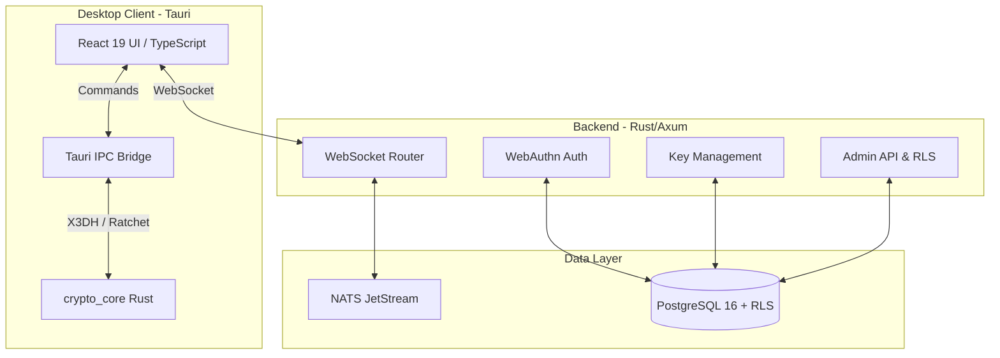

# 🛡️ Trustline

**Enterprise-Grade E2EE Messaging — Zero-Knowledge by Design**

[](https://github.com/mukesh207/Ep2pchat/actions/workflows/ci.yml)
[](LICENSE)

---

## 📖 Project Overview

Trustline is a high-security, multi-tenant, end-to-end encrypted messaging platform designed for confidential enterprise communication. The core architectural philosophy is absolute zero-trust: the server operates strictly as a **zero-knowledge blind router**. It routes encrypted data blobs but fundamentally lacks the cryptographic material to decrypt them. 

All sensitive operations, including key generation, encryption, and decryption, execute natively on the client-side within a secure Rust environment exposed via Tauri IPC. This ensures private keys never leave the hardware boundary of the end-user's device.

## ✨ Core Features

- 🔐 **Zero-Knowledge Blind Router:** The Axum backend stores and routes encrypted blobs but never sees plaintext.
- 🔑 **Advanced Cryptography:** Signal Protocol implementation using X3DH for key exchange and the Double Ratchet Algorithm for forward secrecy and post-compromise security.
- 🪪 **Passwordless Authentication:** Total elimination of passwords via WebAuthn/FIDO2 hardware-bound passkeys.
- 🏢 **Strict Tenant Isolation:** Multi-tenant architecture enforced strictly at the database layer using PostgreSQL Row-Level Security (RLS).
- 📡 **Distributed Event Routing:** High-performance, distributed message routing using NATS JetStream.
- 🗄️ **Secure Local Vault:** Client-side persistence using SQLCipher with AES-GCM column encryption and FTS5 for offline search.
- 🔄 **Automated OTPK Management:** One-Time Pre-Keys are automatically replenished by the Rust core.
- 📱 **Offline Delivery & Sync:** Messages are securely queued on the server and delivered instantly upon reconnection.

## 🏗️ Architecture Overview



## 🛠️ Tech Stack

### Frontend & Client
- **Framework:** React 19, TypeScript 5, Vite 7
- **Styling:** Tailwind CSS 4, shadcn/ui
- **Desktop Runtime:** Tauri v2
- **State Management:** Zustand
- **Local Database:** SQLCipher (SQLite)

### Backend Services
- **API Engine:** Rust, Axum 0.8, Tokio
- **Database:** PostgreSQL 16
- **Message Broker:** NATS JetStream
- **ORM / Querying:** SQLx 0.8
- **Authentication:** WebAuthn-rs, JWT

### Security & Cryptography
- **Core:** libsodium (sodiumoxide)
- **Algorithms:** X25519, Ed25519, ChaCha20-Poly1305, AES-GCM
- **Protocols:** X3DH, Double Ratchet

### DevOps & Deployment
- **Containerization:** Docker, Docker Compose
- **Proxy:** Traefik (mTLS / TLS termination)
- **CI/CD:** GitHub Actions

## 📂 Project Structure

```
Ep2pchat/
├── apps/desktop/              # Tauri v2 + React 19 client
│   ├── src/                   # Frontend logic, UI, hooks
│   └── src-tauri/             # Rust desktop shell, local DB, IPC commands
├── crates/
│   ├── backend/               # Axum REST & WebSocket server
│   └── crypto_core/           # Cryptographic primitives (X3DH, Ratchet)
├── deploy/                    # Docker Compose production stack & Traefik configs
├── docs/                      # Technical, Architectural, and Academic documentation
├── migrations/                # PostgreSQL RLS & schema definitions
└── scripts/                   # Deployment and bootstrapping scripts
```

## 🚀 Installation & Setup

### Prerequisites
- **Rust** 1.80+ (`rustup install stable`)
- **Node.js** 20+ with npm
- **Docker** & Docker Compose
- **libsodium-dev** (Linux: `apt install libsodium-dev`, macOS: `brew install libsodium`)

### Running Locally

1. **Clone the repository:**
   ```bash
   git clone https://github.com/mukesh207/Ep2pchat.git
   cd Ep2pchat
   ```

2. **Environment Configuration:**
   ```bash
   cp .env.example .env
   # Update JWT_SECRET and DATABASE_URL in .env
   ```

3. **Start Core Infrastructure:**
   ```bash
   # Starts PostgreSQL and NATS JetStream
   docker compose up -d
   ```

4. **Run the Axum Backend:**
   ```bash
   cargo run -p backend
   ```

5. **Run the Desktop Client:**
   ```bash
   # In a new terminal split
   cd apps/desktop
   npm install
   npm run tauri dev
   ```

## 🐳 Deployment

Trustline is designed for enterprise self-hosting via Docker and Traefik.

1. Configure production environment:
   ```bash
   cp deploy/.env.production.example deploy/.env.production
   ```
2. Validate and launch the stack:
   ```bash
   make prod-config
   make prod-up
   ```
For detailed instructions, refer to the [Deployment Guide](deploy/README.md).

## 🔒 Security Posture

- **No Passwords:** Hardware-backed WebAuthn completely mitigates phishing and credential stuffing.
- **Zero-Knowledge Architecture:** The server infrastructure never possesses the decryption keys.
- **Database Tenant Isolation:** RLS policies ensure that data leakage between distinct organizations is physically impossible at the SQL query level.
- **Perfect Forward Secrecy:** Compromising a long-term identity key does not compromise past messages.

## 📚 Documentation Reference

- [Architecture & Blueprint](docs/architecture/ARCHITECTURE.md)
- [API & Database Contract](docs/architecture/DATABASE_API_CONTRACT.md)
- [Cryptographic Threat Model](docs/architecture/THREAT_MODEL_CRYPTO.md)
- [Deployment Guide](deploy/README.md)
- [System Requirements & User Stories](docs/product/SRS.md)

## 🔮 Future Scope

- **Mobile Client:** Native iOS and Android clients leveraging Rust core logic via UniFFI.
- **Group Messaging:** Transitioning from pairwise ratchets to IETF Messaging Layer Security (MLS) for scalable N-party E2EE group chats.
- **Federation:** Allowing distinct enterprise Trustline deployments to communicate securely.

---
**License:** [MIT](LICENSE) © Trustline Contributors
