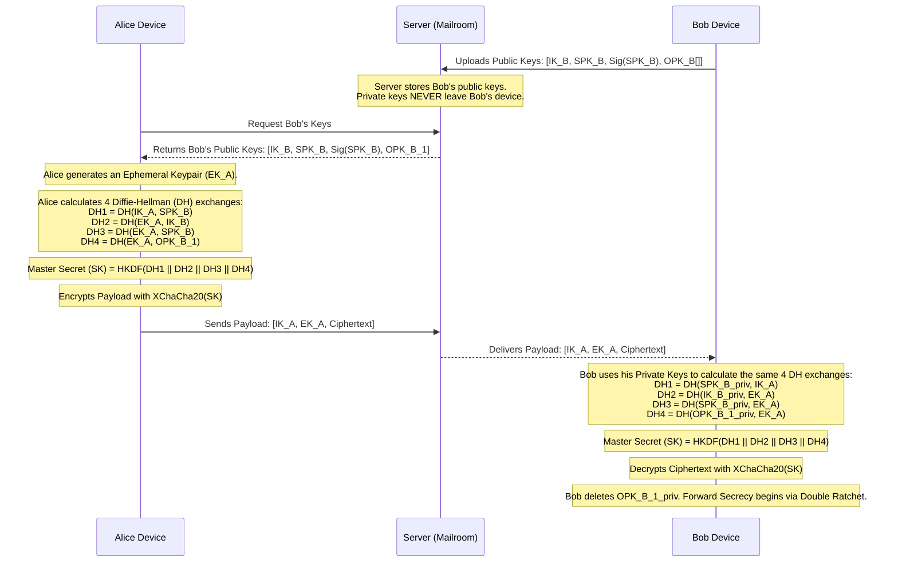

# Trustline: Threat Model & Cryptographic Sequence Diagram

**Document Version:** 1.0
**Context:** This document outlines the fundamental security boundaries of the Trustline application and defines the exact mathematical sequence required to establish an End-to-End Encrypted (E2EE) session between two users.

---

## 1. The Threat Model (Rules of Engagement)

Before implementing cryptography, we must explicitly define what we assume is secure and what we assume is compromised.

### The "Trusted" Zone (What we rely on)
*   **The User's Device (Hardware Enclave):** We trust that the Secure Enclave (e.g., Apple M-Series, TPM) on the physical device cannot have its private keys extracted.
*   **The Application Binary:** We trust the Tauri/ReactNative application has not been modified by malware prior to execution.
*   **The OS Sandbox:** We trust the operating system prevents other apps from reading our application's active RAM.

### The "Untrusted" Zone (What we assume is compromised)
*   **The Network (The Internet):** We assume all traffic between the User and the Server is being recorded by a hostile state actor.
*   **The Server (The Mailroom):** We treat our own Rust routing server and PostgreSQL database as implicitly untrusted. Even if a malicious Admin dumps the entire database, they must not be able to read any messages.
*   **The Future State of a Device:** We assume that eventually, a user's phone *will* be stolen or compromised. Our cryptography must ensure that a compromise tomorrow does not retroactively expose messages sent yesterday (Forward Secrecy).

---

## 2. The Cryptographic Primitives

We rely exclusively on the `libsodium` library to prevent implementation errors.
*   **Identity Keys (IK):** Long-term `X25519` keypair representing the user's specific device.
*   **Signed Pre-Keys (SPK):** Medium-term `X25519` keypair, signed by the Identity Key, rotated periodically (e.g., weekly).
*   **One-Time Pre-Keys (OPK):** Short-term `X25519` keypairs used exactly once per initial session setup.
*   **Symmetric Encryption:** `XChaCha20-Poly1305` for actually encrypting the payload.
*   **KDF (Key Derivation Function):** `HKDF-SHA256` to derive shared secrets.

---

## 3. The Cryptographic Sequence (X3DH Flow)

This sequence explicitly maps out how User A (Alice) establishes a secure session with User B (Bob) when Bob is currently offline.

## 4. Why this Flow protects against our Threat Model
1.  **Server Compromise:** The server only ever sees the public keys (`IK_B`, `SPK_B`) and the encrypted `Ciphertext`. It lacks the private keys required to calculate the Diffie-Hellman math to derive the `Master Secret (SK)`.
2.  **Man-in-the-Middle (MitM):** Alice verifies Bob's `SPK_B` signature to ensure the server hasn't swapped Bob's keys for its own.
3.  **Forward Secrecy:** Because Alice uses an Ephemeral Key (`EK_A`), and Bob deletes his One-Time Pre-Key (`OPK_B_1`) after reading, if Bob's phone is stolen a month later, the attacker cannot reverse-engineer the `Master Secret (SK)` to read this specific message.
