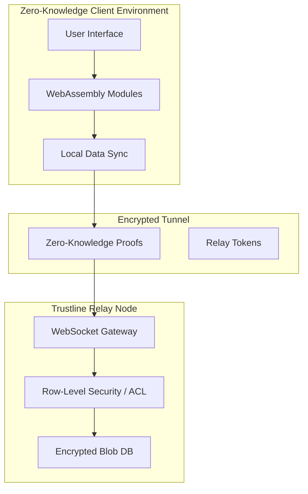

# Trustline: Real-Time Collaboration Platform Overview
*A Self-Hosted End-to-End Encrypted Solution for Confidential Enterprise Workflows*

---

## I. Abstract
This document presents the architecture and visual overview of Trustline, a high-performance, self-hosted collaboration platform designed to secure confidential enterprise workflows. Current enterprise tools often suffer from centralized vulnerabilities and implicit trust models that expose sensitive data to service providers. Trustline mitigates these risks by implementing a client-side Zero-Knowledge Framework. The system leverages memory-hard key derivation and high-throughput authenticated encryption to support real-time data synchronization without a central authority.

## II. Problem Statement
The central challenge addressed by this project is the inherent insecurity of centralized collaboration platforms. Traditional systems exhibit several critical flaws:
- **Implicit Trust**: Breaches often lead to lateral movement due to insufficient internal segmentation.
- **Server-Side Vulnerability**: Service providers often possess the keys to user data, creating a single point of failure.
- **Hardware-Accelerated Attacks**: Legacy hashing is vulnerable to fast GPU attacks.
- **Metadata Exposure**: Behavioral profiling is possible even in encrypted systems if metadata is not properly isolated.

## III. Proposed Solution
Trustline proposes a Secure Real-Time Collaboration Platform built as a self-hosted relay system. The solution integrates advanced cryptographic primitives to create an impenetrable security layer:
- **Zero-Knowledge Core**: All encryption/decryption keys are managed exclusively on the client side.
- **Authenticated Encryption**: Implementing state-of-the-art encryption combined with high security hash algorithms for simultaneous confidentiality and data integrity.
- **Distributed Consistency**: Resolving concurrent edits locally without needing a central source of truth.

---

## IV. Interface Walkthrough & Key Features

Below is a detailed look at the fundamental interfaces of the Trustline application, demonstrating the integration of high-security cryptographic workflows into an intuitive and modern User Interface for seamless enterprise adoption.

### 1. Zero-Knowledge Authentication Screen

*Figure 1: The Trustline Secure Login Interface*

**Detail:**
The authentication process operates completely isolated from the centralized server. Instead of validating plaintext passwords, Trustline utilizes the client's resources to derive an encrypted session key from the passphrase locally using memory-hard algorithms resistant to specialized brute-force hardware.
- The UI features a clean layout, minimizing attack surfaces.
- Only non-reversible, zero-knowledge proofs are relayed to the authentication core.

---

### 2. The Enterprise Collaboration Dashboard

*Figure 2: The Trustline Operational Dashboard*

**Detail:**
Following a successful client-side authentication, users land on the main workspace dashboard built upon the "Zero Trust Architecture".
- **Real-Time Indicators:** The system clearly displays active sync status (e.g., "Zero-Knowledge Sync Active") giving immediate assurance that communications are securely tunneled.
- **Encrypted Workspaces:** Recent files, individual user chats, and shared workspaces are listed on the left panel. The content within these components is rendered dynamically in the local DOM (Document Object Model) but never leaves the machine in plaintext.

---

### 3. Real-Time End-to-End Encrypted (E2EE) Messaging

*Figure 3: Secure 1-on-1 Encrypted Session*

**Detail:**
Within individual collaborative channels, users interact as they would on traditional commercial platforms, but powered by strict client-to-client relay logic.
- **Blind Routing:** Real-time messages are visible here but the routing server only reads metadata necessary to pass fully encrypted "Blobs" to the target device.
- **Visual Confidence:** A permanent lock icon explicitly informs the users about the underlying E2EE status of the chat context.
- **File Encryption:** Attachments (e.g., PDF audits) are encrypted locally prior to transmission, ensuring the centralized servers observe only raw data bytes.

---

### 4. Advanced Endpoint Security Control

*Figure 4: Endpoint and Key Management Settings*

**Detail:**
Unlike basic consumer messengers, Trustline offers enterprise users granular insight into their current session posture and cryptographic environment.
- **Key Rotation & Verification:** The UI presents the active security key standards and allows administrators to observe device keys and their algorithmic generation timestamps.
- **Session Revocation:** Users can instantly terminate unauthorized or outdated sessions to prevent parallel hijacking. Active IP locations, devices, and authentication protocols (e.g., biometrics) are independently configurable per node.

---

## V. System Architecture

The overarching system is a three-tier design relying heavily on client-side components to execute the core trust operations:

## VI. Conclusion
By integrating advanced cryptography and decentralized state management within a visually pleasing and standard enterprise framework, Trustline provides a high-security alternative to legacy centralized systems. The platform ensures that organizations regain digital sovereignty, effectively neutralizing the risk of mass data exposure through server-side compromises.
