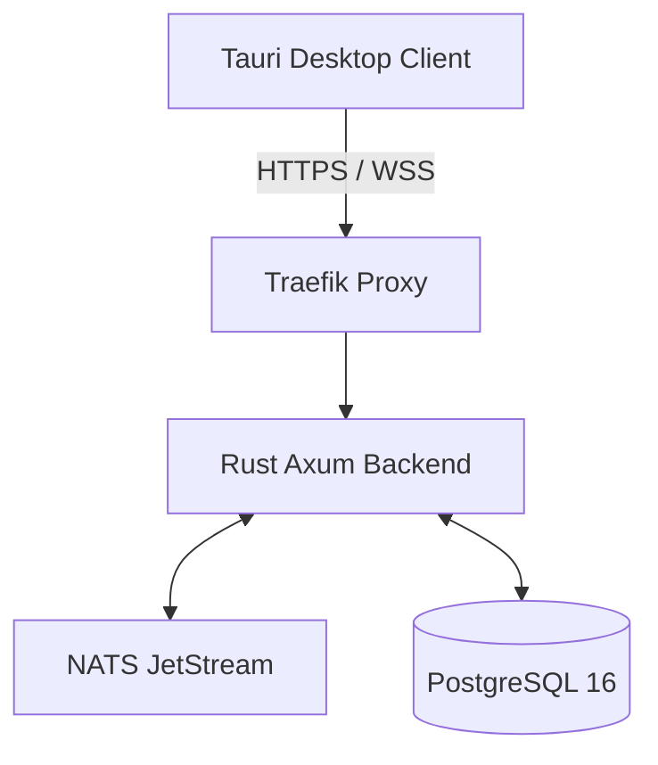

# Software Requirements Specification (SRS)

**Product:** Trustline  
**Version:** 2.0  
**Platform:** Desktop Client (Linux, macOS, Windows) & Self-Hosted Linux Backend

---

## 1. Introduction

### 1.1 Purpose
Trustline is an enterprise collaboration platform designed to secure sensitive team communications. It ensures:
- True end-to-end encryption with perfect forward secrecy.
- Eradication of centralized database vulnerabilities via zero-knowledge architectures.
- High-performance localized operations to emulate traditional, non-secure SaaS chat speeds.

### 1.2 Tagline
> **"Enterprise-Grade E2EE Messaging — Zero-Knowledge by Design"**

---

## 2. Functional Requirements

### 2.1 Authentication & Identity (FR-001)
| ID       | Requirement                                                              |
| -------- | ------------------------------------------------------------------------ |
| FR-001.1 | Users must register exclusively using WebAuthn/FIDO2 hardware Passkeys.  |
| FR-001.2 | The system shall organize users into isolated Organizations (Tenants).   |
| FR-001.3 | Client software must natively generate a client-bound Ed25519 Identity Key. |
| FR-001.4 | Servers must validate auth challenges without receiving plaintext secrets. |

### 2.2 Real-Time Messaging (FR-002)
| ID       | Requirement                                                                 |
| -------- | --------------------------------------------------------------------------- |
| FR-002.1 | The platform shall use WebSockets for real-time bi-directional messaging.   |
| FR-002.2 | The backend shall use NATS JetStream to route messages across instances.    |
| FR-002.3 | Messages must support distinct Delivered and Read state transitions.        |

### 2.3 Cryptographic Engine (FR-003)
| ID       | Requirement                                                                     |
| -------- | ------------------------------------------------------------------------------- |
| FR-003.1 | Implement the X3DH Key Agreement Protocol perfectly to commence chat sessions.  |
| FR-003.2 | Implement the Double Ratchet Algorithm to generate ephemeral keys per message.  |
| FR-003.3 | Automatically provision a set of One-Time Pre-Keys (OTPK) upon authentication.  |
| FR-003.4 | Encrypt all local device storage utilizing SQLite/SQLCipher (AES-256-GCM).      |

### 2.4 Server Infrastructure (FR-004)
| ID       | Requirement                                                                 |
| -------- | --------------------------------------------------------------------------- |
| FR-004.1 | Route messages to targeted devices using only non-encrypted metadata UUIDs. |
| FR-004.2 | Safely queue inbound encrypted blobs for offline users in PostgreSQL.       |
| FR-004.3 | Employ rigorous PostgreSQL Row-Level Security (RLS) explicitly isolating tenants. |

---

## 3. Non-Functional Requirements

### 3.1 Performance Metrics
| ID      | Requirement                                                |
| ------- | ---------------------------------------------------------- |
| NFR-001 | Real-time WebSocket transmission routing must be < 100ms.  |
| NFR-002 | Axum backend must support > 10,000 concurrent WebSockets.  |
| NFR-003 | SQLite Full-Text Search locally must index offline in < 2s.|

### 3.2 Architecture & Security
| ID      | Requirement                                                               |
| ------- | ------------------------------------------------------------------------- |
| NFR-004 | Server API and database strictly operate as Zero-Knowledge elements.      |
| NFR-005 | Cross-tenant memory isolation enforced at the PostgreSQL process level.   |
| NFR-006 | Client application must utilize Tauri to sandbox Rust crypto operations from JS. |

---

## 4. System Architecture

## 5. Data Storage Implementations

| Sub-System         | Persistence Mechanism                                  |
| ------------------ | ------------------------------------------------------ |
| Encrypted Blobs    | PostgreSQL 16 server-side.                             |
| Ephemeral Keys     | Rust `crypto_core` (in-memory, dropped immediately).   |
| Local App History  | SQLCipher (AES-GCM encryption on localized SQLite).    |
| Message Routing    | NATS server-side JetStream log cache.                  |

## 6. Constraints
- All server-side analytics regarding message content are fundamentally prohibited.
- Devices absent hardware-backed WebAuthn support cannot successfully register identities.
- Native keyword searches are relegated specifically to the client's localized SQLite file.
