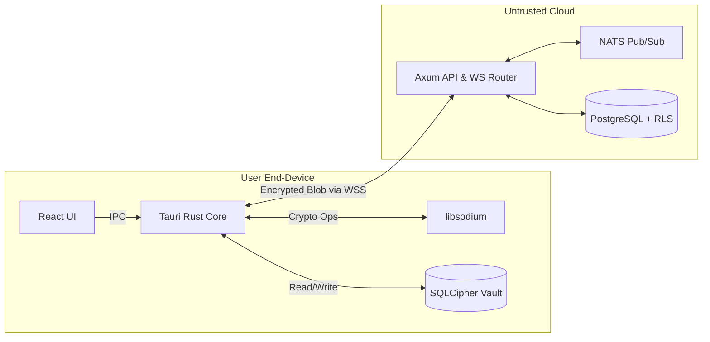
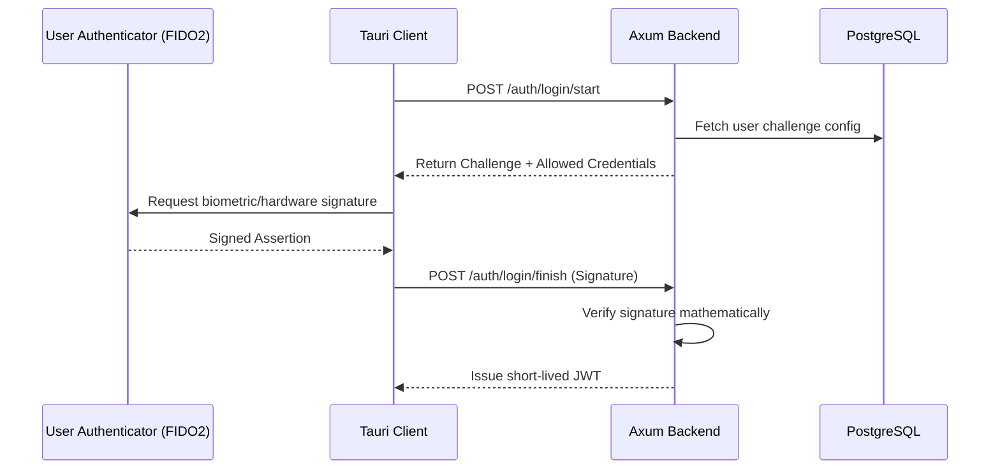
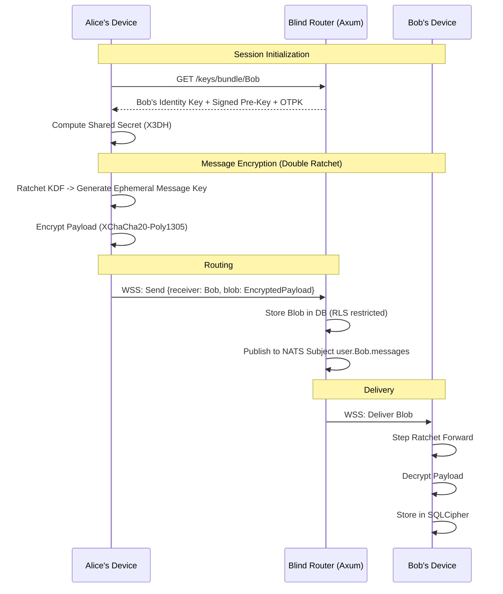

# IEEE Formatting Diagrams & Workflows

**Version:** 2.0  
**Context:** Trustline Platform

This document describes the core workflows and sequence diagrams suitable for IEEE paper submissions.

## 1. Zero-Knowledge System Architecture

*Figure 1: High-Level Architecture showing the separation of the trusted execution environment (local device) from the untrusted routing infrastructure (server).*

---

## 2. WebAuthn Passwordless Flow

*Figure 2: Authentication sequence demonstrating the absence of shared secrets (passwords) over the wire.*

---

## 3. X3DH Key Agreement & Message Routing

*Figure 3: Sequence diagram detailing the integration of X3DH for session establishment and the Double Ratchet for forward-secret message delivery via an untrusted router.*
