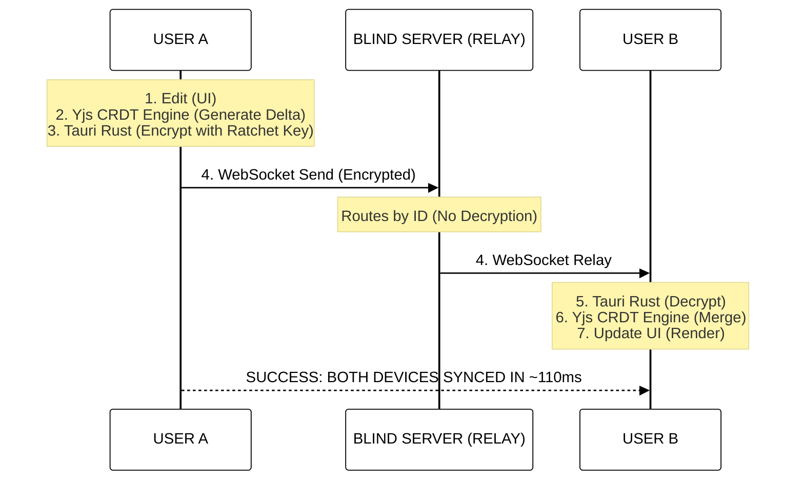
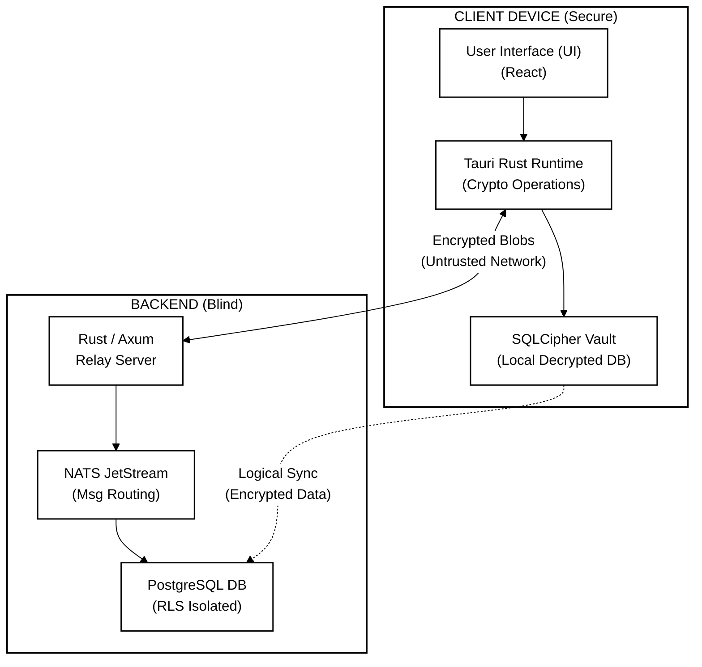
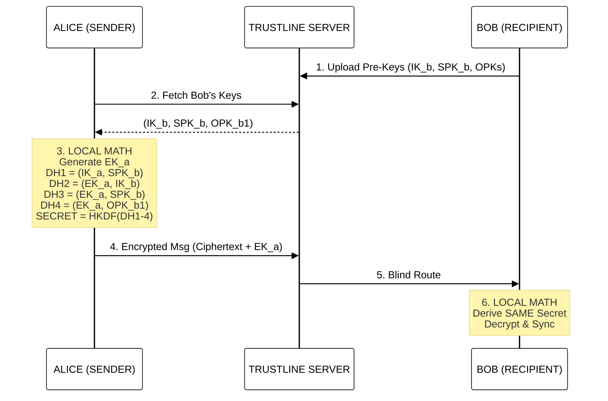
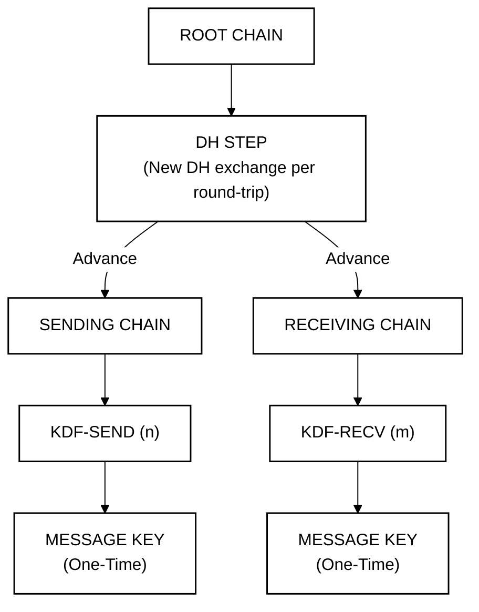
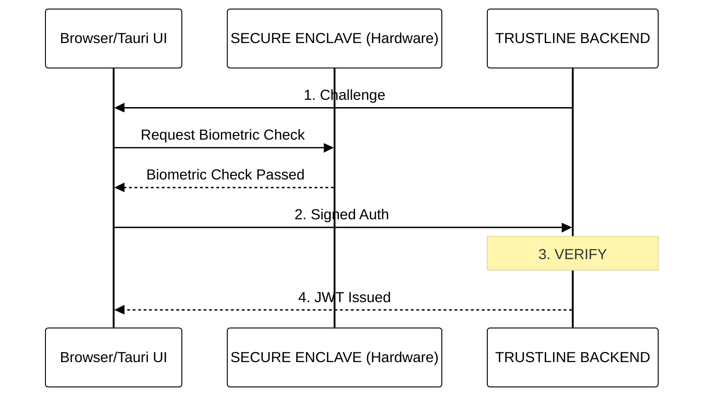
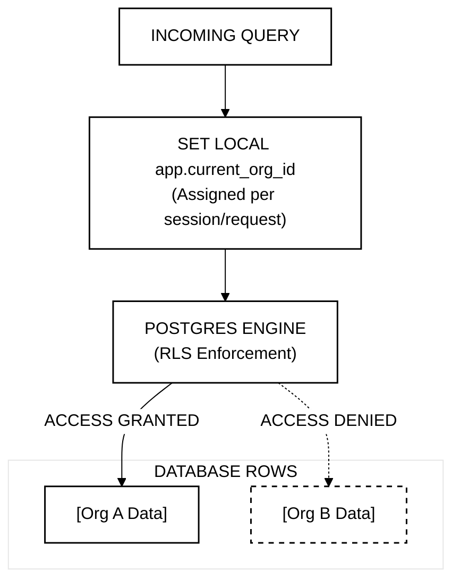

# Trustline IEEE Formatted Diagrams

The following diagrams have been converted from their original text-based ASCII format into IEEE-compliant Mermaid visualizations. They are styled in a professional, monochrome format (black outlines, white background, Times New Roman font) to meet the strict formatting requirements of academic publications.

You can right-click any of the rendered diagrams below and save them as an image or copy them to your clipboard to paste directly into your `Trustline_IEEE_Formatted.docx` file.

---

### 1. CRDT Synchronization Flow
Converted from `CRDT_flow.txt`

---

### 2. Zero-Knowledge "Blind Router" Logic
Converted from `diagram.txt` (Section 1)

---

### 3. X3DH Key Agreement (Asynchronous Setup)
Converted from `diagram.txt` (Section 2)

---

### 4. The Double Ratchet Protocol
Converted from `diagram.txt` (Section 3)

---

### 5. WebAuthn Passwordless Authentication
Converted from `diagram.txt` (Section 4)

---

### 6. PostgreSQL Row-Level Security (RLS)
Converted from `diagram.txt` (Section 5)

